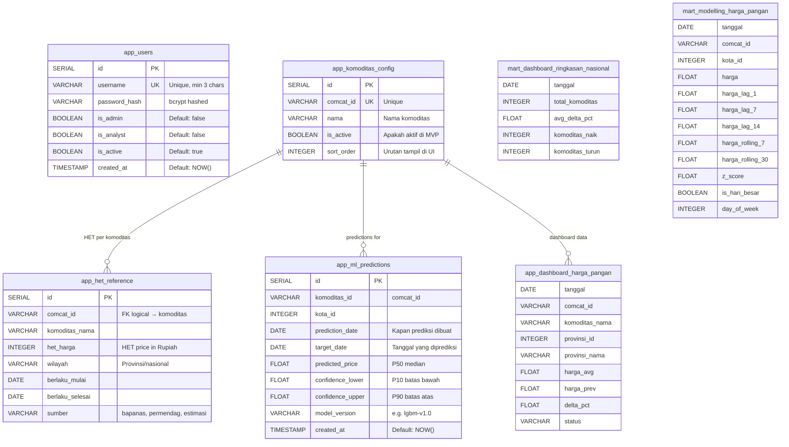
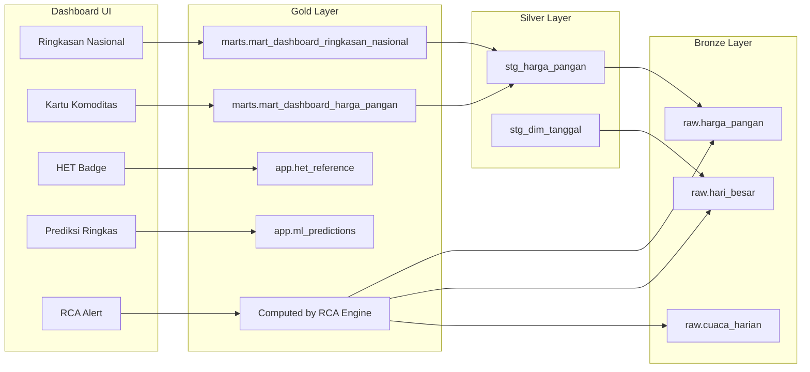
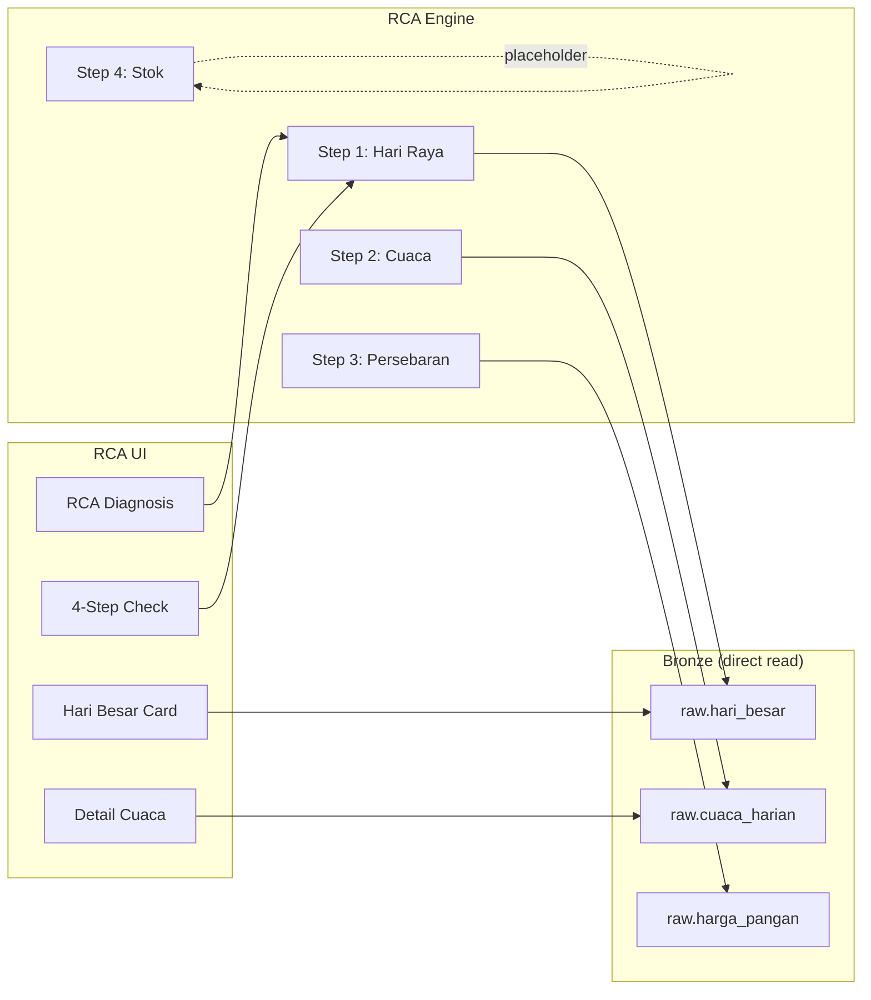
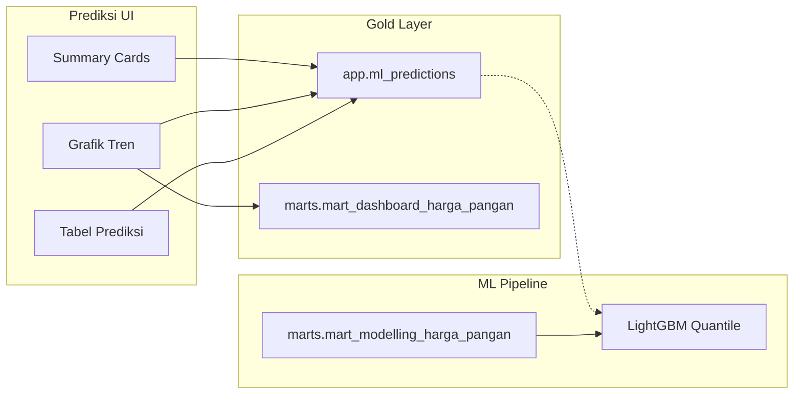

# ERD — R.A.D.A.R Pangan

> Entity Relationship Diagram
> Tanggal: 25 Mei 2026 | Tim Simatana
> Referensi: [PRD](../prd/PRD.md) | [FRD](../frd/FRD.md) | [Wireframe](../wireframe/wireframe-all-pages.html)

---

## 1. Prinsip Desain

### 1.1 Dual Database Architecture

R.A.D.A.R Pangan menggunakan **dua database** dengan fungsi yang jelas terpisah berdasarkan Medallion layer:

| Database | Layer | Fungsi | Akses |
|----------|-------|--------|-------|
| **Google BigQuery** | Bronze + Silver | Data warehouse — raw extracts, cleaned/validated data, heavy transformations | ETL writes, dbt transforms |
| **PostgreSQL** (Docker) | Gold | Serving layer — ready-to-use data, dikonsumsi langsung oleh UI/API/ML | App reads, dbt/sync writes |

**Deployment strategy:**
- **Development & Demo**: PostgreSQL via Supabase (managed, gratis)
- **Production (go-live)**: PostgreSQL via Docker image (`postgres:16-alpine`)
- Code database-agnostic — connection string via env var, pure `psycopg2` driver

### 1.2 Medallion Architecture

Data flow mengikuti **Medallion Architecture** (Bronze → Silver → Gold) dengan pembagian database yang jelas:

```
Data Sources → [Bronze] → [Silver] ──dbt──▶ [Gold] → UI / ML
                 raw.*    staging.*          marts.*
               BigQuery   BigQuery           app.*
                                          PostgreSQL
```

| Layer | Database | Prinsip | Managed By |
|-------|----------|---------|------------|
| **Bronze** (`raw.*`) | BigQuery | As-is, immutable, append-only | ETL Python scripts |
| **Silver** (`staging.*`) | BigQuery | Cleaned, validated, deduplicated, normalized | dbt (SQL views) |
| **Gold** (`marts.*` + `app.*`) | PostgreSQL | Consumption-ready, low-latency, didesain dari kebutuhan UI/ML | dbt sync + App logic |

**Mengapa Gold di PostgreSQL (bukan BigQuery)?**
- **Latency**: BigQuery ~1-3 detik per query vs PostgreSQL ~1-5ms
- **Cost**: BigQuery menghitung per-query (1 TB free/bulan) — ribuan request dashboard bisa mahal
- **Team access**: Semua teammate (termasuk ML) cukup connect ke 1 PostgreSQL — tidak perlu IAM GCP
- **Solve BigQuery latency issue**: Tidak perlu implement caching layer di app — Gold layer sudah pre-computed di PostgreSQL

### 1.3 Desain ERD Driven by UI

ERD ini didesain **backward dari wireframe** — dimulai dari data yang ditampilkan di UI, lalu diturunkan ke Gold → Silver → Bronze.

---

## 2. ERD Diagram (Mermaid)

### 2.1 Full ERD — BigQuery (Data Warehouse)

```mermaid
erDiagram
    %% ═══════════════════════════════════════════════════
    %% BRONZE LAYER (raw.*)
    %% ═══════════════════════════════════════════════════

    raw_harga_pangan {
        INT64 id PK "Auto-increment"
        DATE tanggal "Partition key"
        STRING comcat_id "FK → dim_komoditas"
        STRING komoditas_nama "Denormalized name"
        INT64 pasar_tipe "1=Tradisional, 2=Modern, 3=Besar, 4=Produsen"
        INT64 provinsi_id "FK → dim_provinsi"
        STRING provinsi_nama "Denormalized name"
        INT64 kota_id "FK → dim_kota"
        STRING kota_nama "Denormalized name"
        STRING pasar_nama "Optional"
        FLOAT64 harga "Harga per satuan (Rp)"
        STRING satuan "Default: kg"
        TIMESTAMP _extracted_at "ETL audit"
        STRING _source "bi_pihps"
    }

    raw_cuaca_harian {
        INT64 id PK
        DATE tanggal "Partition key"
        STRING lokasi_label "Bandung, Jakarta, etc"
        INT64 provinsi_id "FK → dim_provinsi"
        FLOAT64 latitude
        FLOAT64 longitude
        FLOAT64 precipitation_sum "Curah hujan (mm)"
        FLOAT64 rain_sum "Hujan (mm)"
        FLOAT64 temperature_max "Suhu max (C)"
        FLOAT64 temperature_min "Suhu min (C)"
        FLOAT64 wind_speed_max "Angin max (km/h)"
        FLOAT64 et0_evapotranspiration "mm"
        FLOAT64 sunshine_duration "detik"
        TIMESTAMP _extracted_at
        STRING _source "open_meteo"
    }

    raw_hari_besar {
        INT64 id PK
        DATE tanggal
        STRING nama "Nama hari besar"
        STRING kategori "islam, kristen, nasional, cuti_bersama"
        INT64 tahun
    }

    raw_dim_provinsi {
        INT64 provinsi_id PK
        STRING provinsi_nama
        TIMESTAMP _extracted_at
    }

    raw_dim_kota {
        INT64 kota_id PK
        STRING kota_nama
        INT64 provinsi_id "FK → dim_provinsi"
        TIMESTAMP _extracted_at
    }

    raw_pipeline_log {
        INT64 id PK
        STRING run_id "Unique run ID"
        STRING pipeline_name
        DATE tanggal_mulai
        DATE tanggal_selesai
        INT64 records_inserted
        STRING status "running, success, failed"
        STRING error_message
        TIMESTAMP started_at "Partition key"
        TIMESTAMP finished_at
    }

    raw_inflasi_bulanan {
        INT64 id PK
        INT64 tahun
        INT64 bulan "1-12"
        STRING komoditas_id "FK → comcat_id"
        FLOAT64 inflasi_mtm "Month-to-Month %"
        FLOAT64 inflasi_ytd "Year-to-Date %"
        STRING sumber "dummy atau bps"
    }

    raw_musim_panen {
        INT64 id PK
        STRING komoditas_id "FK → comcat_id"
        STRING komoditas_nama
        INT64 bulan_mulai "1-12"
        INT64 bulan_selesai "1-12"
        STRING daerah_utama
        STRING catatan
    }

    %% ═══════════════════════════════════════════════════
    %% RELATIONSHIPS (Bronze)
    %% ═══════════════════════════════════════════════════

    raw_dim_provinsi ||--o{ raw_dim_kota : "has cities"
    raw_dim_provinsi ||--o{ raw_harga_pangan : "prices in"
    raw_dim_provinsi ||--o{ raw_cuaca_harian : "weather for"
    raw_dim_kota ||--o{ raw_harga_pangan : "prices at"

    %% ═══════════════════════════════════════════════════
    %% SILVER LAYER (staging.* — dbt views)
    %% ═══════════════════════════════════════════════════

    stg_harga_pangan {
        DATE tanggal
        STRING comcat_id
        INT64 provinsi_id
        INT64 kota_id
        INT64 pasar_tipe
        FLOAT64 harga "Validated, deduped"
        STRING komoditas_nama
        STRING provinsi_nama
        STRING kota_nama
    }

    stg_dim_komoditas {
        STRING comcat_id PK
        STRING komoditas_nama
        STRING kategori
    }

    stg_dim_tanggal {
        DATE tanggal PK
        INT64 tahun
        INT64 bulan
        INT64 hari
        INT64 day_of_week "1=Sun, 7=Sat"
        BOOLEAN is_hari_besar
        STRING nama_hari_besar
        BOOLEAN is_weekend
    }

    stg_dim_provinsi {
        INT64 provinsi_id PK
        STRING provinsi_nama
    }

    stg_dim_kota {
        INT64 kota_id PK
        STRING kota_nama
        INT64 provinsi_id
    }

    stg_fact_harga_pangan {
        DATE tanggal "FK → dim_tanggal"
        STRING comcat_id "FK → dim_komoditas"
        INT64 kota_id "FK → dim_kota"
        INT64 pasar_tipe "FK → dim_pasar_tipe"
        FLOAT64 harga
    }

    %% ═══════════════════════════════════════════════════
    %% GOLD LAYER (marts.* — dbt tables)
    %% ═══════════════════════════════════════════════════

    mart_dashboard_harga_pangan {
        DATE tanggal
        STRING comcat_id
        STRING komoditas_nama
        INT64 provinsi_id
        STRING provinsi_nama
        FLOAT64 harga_avg "Rata-rata harga hari ini"
        FLOAT64 harga_prev "Harga kemarin"
        FLOAT64 delta_pct "Perubahan % hari ini vs kemarin"
        STRING status "naik, turun, stabil"
        INT64 jumlah_kota "Jumlah kota dengan data"
    }

    mart_dashboard_ringkasan_nasional {
        DATE tanggal
        INT64 total_komoditas
        FLOAT64 avg_delta_pct "Rata-rata perubahan semua komoditas"
        INT64 komoditas_naik "Count komoditas harga naik"
        INT64 komoditas_turun "Count komoditas harga turun"
    }

    mart_modelling_harga_pangan {
        DATE tanggal
        STRING comcat_id
        INT64 kota_id
        FLOAT64 harga
        FLOAT64 harga_lag_1 "Harga H-1"
        FLOAT64 harga_lag_7 "Harga H-7"
        FLOAT64 harga_lag_14 "Harga H-14"
        FLOAT64 harga_rolling_7 "Rolling avg 7 hari"
        FLOAT64 harga_rolling_30 "Rolling avg 30 hari"
        FLOAT64 z_score "Z-score vs 30-day mean"
        BOOLEAN is_hari_besar
        INT64 day_of_week
    }

    %% ═══════════════════════════════════════════════════
    %% RELATIONSHIPS (Silver → Gold)
    %% ═══════════════════════════════════════════════════

    raw_harga_pangan ||--|| stg_harga_pangan : "cleaned"
    stg_harga_pangan ||--|| mart_dashboard_harga_pangan : "aggregated"
    stg_harga_pangan ||--|| mart_modelling_harga_pangan : "features"
    stg_dim_komoditas ||--o{ stg_fact_harga_pangan : "dimension"
    stg_dim_kota ||--o{ stg_fact_harga_pangan : "dimension"
    stg_dim_tanggal ||--o{ stg_fact_harga_pangan : "dimension"
```



### 2.2 Full ERD — PostgreSQL (Gold / Serving Layer)

> **Dev & Demo**: Supabase managed PostgreSQL
> **Production**: Docker `postgres:16-alpine`



---

## 3. Data Flow: UI → Gold Layer → Silver → Bronze

### 3.1 Dashboard Page



### 3.2 RCA Page



### 3.3 Prediksi Page



---

## 4. Tabel Detail

### 4.1 BigQuery — Bronze Layer

#### `raw.harga_pangan`
| Column | Type | Mode | PK/FK | Description |
|--------|------|------|-------|-------------|
| id | INT64 | REQUIRED | PK | Auto-increment |
| tanggal | DATE | REQUIRED | — | Partition key, tanggal harga |
| comcat_id | STRING | REQUIRED | FK | Commodity category ID (e.g. com_11) |
| komoditas_nama | STRING | REQUIRED | — | Nama komoditas (denormalized) |
| pasar_tipe | INT64 | REQUIRED | — | 1=Tradisional, 2=Modern, 3=Besar, 4=Produsen |
| provinsi_id | INT64 | REQUIRED | FK | FK → dim_provinsi |
| provinsi_nama | STRING | REQUIRED | — | Denormalized |
| kota_id | INT64 | REQUIRED | FK | FK → dim_kota |
| kota_nama | STRING | REQUIRED | — | Denormalized |
| pasar_nama | STRING | NULLABLE | — | Nama pasar (optional) |
| harga | FLOAT64 | REQUIRED | — | Harga per satuan (Rp) |
| satuan | STRING | REQUIRED | — | Default: "kg" |
| _extracted_at | TIMESTAMP | NULLABLE | — | ETL audit timestamp |
| _source | STRING | NULLABLE | — | "bi_pihps" |

**Partitioning**: DAY on `tanggal` (require_partition_filter = true)
**Clustering**: `comcat_id`, `provinsi_id`, `kota_id`
**Volume**: ~619K rows (growing daily)

#### `raw.cuaca_harian`
| Column | Type | Mode | Description |
|--------|------|------|-------------|
| id | INT64 | REQUIRED | PK |
| tanggal | DATE | REQUIRED | Partition key |
| lokasi_label | STRING | REQUIRED | "Bandung", "Jakarta", etc |
| provinsi_id | INT64 | REQUIRED | FK → dim_provinsi |
| latitude | FLOAT64 | REQUIRED | |
| longitude | FLOAT64 | REQUIRED | |
| precipitation_sum | FLOAT64 | NULLABLE | Curah hujan total (mm/hari) |
| rain_sum | FLOAT64 | NULLABLE | Hujan saja (mm) |
| temperature_max | FLOAT64 | NULLABLE | Suhu max (°C) |
| temperature_min | FLOAT64 | NULLABLE | Suhu min (°C) |
| wind_speed_max | FLOAT64 | NULLABLE | Angin max (km/h) |
| et0_evapotranspiration | FLOAT64 | NULLABLE | Evapotranspirasi (mm) |
| sunshine_duration | FLOAT64 | NULLABLE | Sinar matahari (detik) |
| _extracted_at | TIMESTAMP | NULLABLE | ETL audit |
| _source | STRING | NULLABLE | "open_meteo" |

**Partitioning**: DAY on `tanggal`
**Clustering**: `provinsi_id`
**Volume**: ~11K rows

#### `raw.hari_besar`
| Column | Type | Mode | Description |
|--------|------|------|-------------|
| id | INT64 | REQUIRED | PK |
| tanggal | DATE | REQUIRED | Tanggal hari besar |
| nama | STRING | REQUIRED | "Idul Fitri", "Natal", etc |
| kategori | STRING | REQUIRED | islam, kristen, nasional, cuti_bersama, lainnya |
| tahun | INT64 | REQUIRED | Tahun |

**Volume**: 91 rows (2024-2027)

### 4.2 PostgreSQL — Gold Layer (App/Serving)

#### `app.users`
| Column | Type | Constraint | Description |
|--------|------|-----------|-------------|
| id | SERIAL | PK | Auto-increment |
| username | VARCHAR | UNIQUE, NOT NULL | Min 3 chars |
| password_hash | VARCHAR | NOT NULL | bcrypt hash |
| is_admin | BOOLEAN | DEFAULT false | Admin flag |
| is_analyst | BOOLEAN | DEFAULT false | Analyst flag |
| is_active | BOOLEAN | DEFAULT true | Soft delete flag |
| created_at | TIMESTAMP | DEFAULT NOW() | Creation timestamp |

#### `app.het_reference`
| Column | Type | Constraint | Description |
|--------|------|-----------|-------------|
| id | SERIAL | PK | |
| comcat_id | VARCHAR | NOT NULL | e.g. "com_11" |
| komoditas_nama | VARCHAR | NOT NULL | "Bawang Merah" |
| het_harga | INTEGER | NOT NULL | HET price (Rp) |
| wilayah | VARCHAR | | Provinsi or "nasional" |
| berlaku_mulai | DATE | | Start date |
| berlaku_selesai | DATE | | End date |
| sumber | VARCHAR | | "bapanas", "permendag", "estimasi" |

#### `app.ml_predictions`
| Column | Type | Constraint | Description |
|--------|------|-----------|-------------|
| id | SERIAL | PK | |
| komoditas_id | VARCHAR | NOT NULL | comcat_id |
| kota_id | INTEGER | NOT NULL | |
| prediction_date | DATE | NOT NULL | When prediction was made |
| target_date | DATE | NOT NULL | Date being predicted |
| predicted_price | FLOAT | | P50 median price |
| confidence_lower | FLOAT | | P10 lower bound |
| confidence_upper | FLOAT | | P90 upper bound |
| model_version | VARCHAR | | e.g. "lgbm-v1.0" |
| created_at | TIMESTAMP | DEFAULT NOW() | |

#### `app.komoditas_config`
| Column | Type | Constraint | Description |
|--------|------|-----------|-------------|
| id | SERIAL | PK | |
| comcat_id | VARCHAR | UNIQUE | e.g. "com_11" |
| nama | VARCHAR | NOT NULL | "Bawang Merah" |
| is_active | BOOLEAN | DEFAULT true | Active in MVP |
| sort_order | INTEGER | | Display order in UI |

---

## 5. Catatan Desain

### 5.1 Mengapa Dual Database?

| Concern | BigQuery (Bronze + Silver) | PostgreSQL (Gold) |
|---------|---------------------------|-------------------|
| **Fungsi** | Heavy compute, batch transforms, storage | Low-latency serving, app reads/writes |
| **Latency** | ~1-3 detik (cold query) | ~1-5ms |
| **Write pattern** | Batch (ETL, dbt) | Transactional (user CRUD, predictions insert) |
| **Read pattern** | Analytical (aggregation, window functions) | Point queries (by ID, by date) |
| **Cost at scale** | 10 GB storage + 1 TB queries free | Docker: sesuai VPS cost |
| **dbt** | ✅ Native (dbt-bigquery) | ✅ Native (dbt-postgres) |
| **Team access** | Perlu IAM GCP | Cukup connection string |

**Prinsip**: Semua data yang ditampilkan di UI berasal dari **PostgreSQL (Gold)**, bukan langsung dari BigQuery. BigQuery hanya untuk storage + compute pipeline.

### 5.2 Denormalization di Bronze

Bronze layer (`raw.harga_pangan`) sengaja **denormalized** — `komoditas_nama`, `provinsi_nama`, `kota_nama` disimpan langsung di tabel harga. Alasan:
- Data mentah dari PIHPS API sudah dalam format denormalized
- BigQuery optimized untuk denormalized schemas (columnar storage)
- Menghindari JOIN di query analytics (cost optimization)

Normalisasi dilakukan di **Silver layer** (dbt views) untuk data quality.

### 5.3 Gold Layer = UI Driven

Gold layer tables didesain berdasarkan wireframe:
- `mart_dashboard_harga_pangan` → supply data untuk **Dashboard kartu komoditas**
- `mart_dashboard_ringkasan_nasional` → supply data untuk **Dashboard ringkasan**
- `mart_modelling_harga_pangan` → supply features untuk **ML training**
- `app.ml_predictions` → supply data untuk **Prediksi page**
- `app.het_reference` → supply data untuk **HET badge** di Dashboard

### 5.4 Database Deployment Strategy

| Stage | PostgreSQL | BigQuery | Status |
|-------|-----------|----------|--------|
| **Development & Demo** | Supabase (managed, free tier) | GCP free tier | ✅ Current — tidak ada perubahan |
| **Production (go-live)** | Docker PostgreSQL (self-hosted di VPS) | GCP (free/paid tier) | 🔜 Post-hackathon |

**Dev & Demo (sekarang):** Fully pakai Supabase. Gratis, sudah jalan, tidak perlu setup tambahan.

**Production (nanti):** Migrasi Gold layer ke Docker PostgreSQL di VPS.
- Perlu plan spesifikasi server (estimasi: 2 vCPU, 4GB RAM, 20-40GB SSD)
- Docker Compose all-in-one (App + PostgreSQL + ML serving)
- Migrasi dari Supabase → Docker hanya ganti env var (host, port, password)

**Implikasi untuk code:**
- Connection string via environment variable (`SUPABASE_HOST`, `SUPABASE_PORT`, dll → nanti jadi `DB_HOST`, `DB_PORT`)
- Tidak ada Supabase-specific SDK / feature yang digunakan — pure PostgreSQL driver (`psycopg2`)
- Schema `app.*` dan `marts.*` tetap sama, tidak ada perubahan DDL

**docker-compose.yml (production):**
```yaml
services:
  app:
    build: .
    ports: ["8000:8000"]
    depends_on: [db]
    env_file: .envs/.env

  db:
    image: postgres:16-alpine
    volumes: ["pgdata:/var/lib/postgresql/data"]
    environment:
      POSTGRES_DB: radarpangan
      POSTGRES_USER: postgres
      POSTGRES_PASSWORD: ${DB_PASSWORD}

  ml:  # optional, jika ML model serving dibutuhkan
    build: ./ml
    ports: ["8001:8001"]

volumes:
  pgdata:
```

### 5.5 Perubahan dari Current ERD

| Aspek | Sebelum | Sekarang | Alasan |
|-------|---------|----------|--------|
| Naming convention | Inconsistent (campur raw.* dan app.*) | Konsisten per layer (Bronze/Silver/Gold) | Clarity |
| `app.het_reference` | Hanya comcat_id + harga | + wilayah, berlaku_mulai/selesai, sumber | HET bisa beda per wilayah |
| `app.komoditas_config` | Minimal | + is_active, sort_order | UI needs display control |
| `mart_dashboard_ringkasan_nasional` | Belum ada definisi formal | Defined with columns | Dashboard needs this |
| Medallion terminology | raw/staging/marts | Bronze/Silver/Gold mapping documented | Industry standard |
