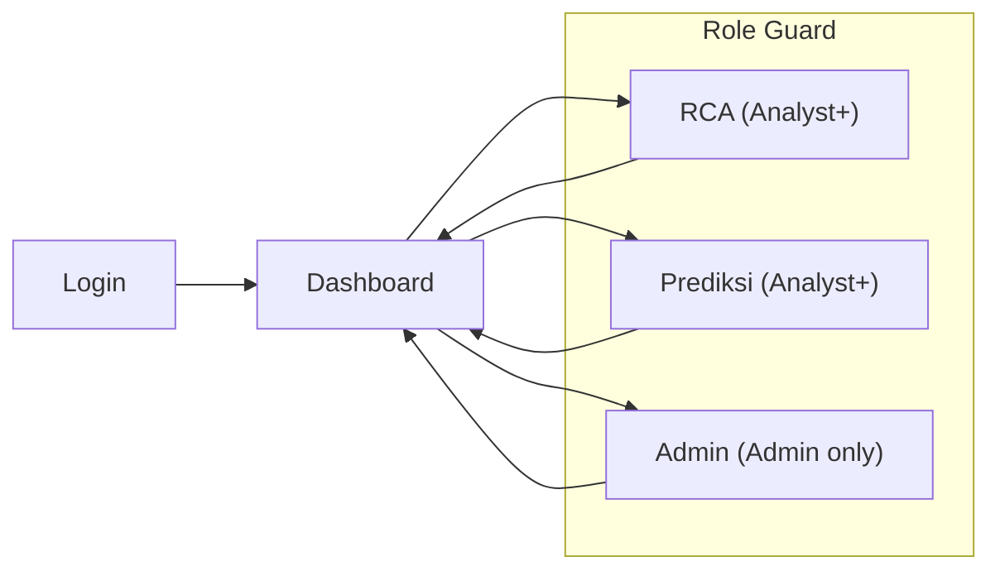

# FRD — R.A.D.A.R Pangan

> Functional Requirements Document
> Tanggal: 16 Mei 2026 | Tim Simatana
> Referensi: [PRD](../prd/PRD.md) | Proposal Tahap 1

---

## 1. Pendahuluan

### 1.1 Tujuan Dokumen

Dokumen ini menjabarkan **spesifikasi fungsional detail** setiap fitur R.A.D.A.R Pangan, mencakup:
- User stories dan skenario penggunaan
- Business rules dan logika
- Spesifikasi input/output
- Acceptance criteria
- Batasan dan dependensi

### 1.2 Scope

Dokumen ini mencakup **MVP scope** sesuai PRD:
- 6 komoditas (bawang merah, bawang putih, cabai merah besar, cabai merah keriting, cabai rawit hijau, cabai rawit merah)
- 4 provinsi (Banten, Jawa Barat, DKI Jakarta, Sulawesi Selatan)
- 5 halaman (Login, Dashboard, RCA, Prediksi ML, Admin)

### 1.3 Konvensi

| Label | Arti |
|-------|------|
| **[MUST]** | Wajib ada di MVP demo |
| **[SHOULD]** | Sebaiknya ada, skip jika waktu tidak cukup |
| **[COULD]** | Nice-to-have, untuk Phase 2 |
| **[P]** | Placeholder — ada di UI tapi data belum real |

---

## 2. Halaman & Navigation

### 2.1 Daftar Halaman

| # | Halaman | URL | Role Minimum | Deskripsi |
|---|---------|-----|-------------|-----------|
| 1 | Login | `/login` | Public | Form login (username + password) |
| 2 | Dashboard | `/` | Viewer | Monitoring overview: harga, HET, prediksi ringkas, RCA alert |
| 3 | Analisis RCA | `/rca` | Analyst | Root cause analysis detail per komoditas |
| 4 | Prediksi ML | `/prediksi` | Analyst | Prediksi harga 7-14 hari + confidence interval |
| 5 | Admin | `/admin` | Admin | User management CRUD |

### 2.2 Navigation Flow



### 2.3 Navigation Bar **[MUST]**

| Komponen | Deskripsi |
|----------|-----------|
| Logo / App name | "R.A.D.A.R Pangan" — klik → Dashboard |
| Nav links | Dashboard, Analisis RCA, Prediksi ML — conditional berdasarkan role |
| Admin link | Hanya tampil untuk role Admin |
| User info | Tampilkan username + role badge |
| Logout button | Clear JWT token dari localStorage → redirect ke Login |

**Responsive behavior**:
- **Mobile**: Hamburger menu (collapse nav links)
- **Tablet**: Horizontal nav, text dipendekkan
- **Desktop**: Full horizontal nav dengan label lengkap

---

## 3. F1: Authentication & Authorization

### 3.1 Login Page

#### User Story
> Sebagai pengguna, saya ingin login dengan username dan password agar bisa mengakses dashboard sesuai role saya.

#### Spesifikasi

| Field | Type | Validasi | Required |
|-------|------|----------|----------|
| Username | text input | Min 3 karakter, tidak boleh kosong | Yes |
| Password | password input | Min 8 karakter, tidak boleh kosong | Yes |

#### Business Rules

| # | Rule | Detail |
|---|------|--------|
| BR-AUTH-01 | Login menghasilkan JWT token | HS256, expire 8 jam, payload: `{sub, username, role, is_admin, is_analyst}` |
| BR-AUTH-02 | Token disimpan di localStorage | Key: `token` |
| BR-AUTH-03 | Setiap request API mengirim `Authorization: Bearer <token>` | Kecuali `/api/auth/login` dan static files |
| BR-AUTH-04 | Password di-hash dengan bcrypt | Tidak pernah disimpan dalam plaintext |
| BR-AUTH-05 | User tidak aktif (`is_active=false`) tidak bisa login | Return 401 "Akun dinonaktifkan" |

#### Acceptance Criteria

- [x] **[MUST]** Login berhasil dengan credential valid → redirect ke Dashboard
- [x] **[MUST]** Login gagal → tampilkan pesan error yang jelas
- [x] **[MUST]** Field kosong → tampilkan validasi
- [x] **[MUST]** Halaman selain Login redirect ke Login jika belum login
- [ ] **[SHOULD]** Rate limiting: max 5 login attempts per IP per menit

### 3.2 Role-Based Access Control (RBAC)

#### Role Matrix

| Resource | Viewer | Analyst | Admin |
|----------|--------|---------|-------|
| `GET /` (Dashboard) | ✅ Read-only | ✅ Full | ✅ Full |
| `GET /rca` | ❌ Redirect | ✅ Full | ✅ Full |
| `GET /prediksi` | ❌ Redirect | ✅ Full | ✅ Full |
| `GET /admin` | ❌ Redirect | ❌ Redirect | ✅ Full |
| `GET /api/commodities` | ✅ | ✅ | ✅ |
| `GET /api/rca/*` | ❌ 401 | ✅ | ✅ |
| `GET /api/het/*` | ✅ | ✅ | ✅ |
| `GET /api/predictions` | ❌ 401 | ✅ | ✅ |
| `GET /api/data-quality/*` | ❌ 401 | ❌ 401 | ✅ |
| `*/api/auth/users*` | ❌ 401 | ❌ 401 | ✅ |

#### Business Rules

| # | Rule |
|---|------|
| BR-RBAC-01 | Role ditentukan oleh boolean flags: `is_admin`, `is_analyst` |
| BR-RBAC-02 | `is_admin=true` → akses semua |
| BR-RBAC-03 | `is_analyst=true` → Dashboard + RCA + Prediksi |
| BR-RBAC-04 | Keduanya `false` → Viewer (Dashboard read-only) |
| BR-RBAC-05 | Frontend guard: redirect ke Dashboard jika role tidak cukup |
| BR-RBAC-06 | **[SHOULD]** Backend guard: return 401/403 jika role tidak cukup (server-side enforcement) |

---

## 4. F2: Dashboard Monitoring & Overview

### 4.1 Overview

> Sebagai analis TPID, saya ingin melihat status harga seluruh komoditas pantauan dalam satu halaman agar bisa langsung identifikasi mana yang bermasalah.

#### Layout (Mobile-First)

```
┌─────────────────────────┐
│     Header + Nav        │
├─────────────────────────┤
│   Date Filter           │
├─────────────────────────┤
│   Ringkasan Nasional    │
│   (3-4 summary cards)   │
├─────────────────────────┤
│   RCA Alert Summary     │
│   (komoditas anomali)   │
├─────────────────────────┤
│   Kartu Komoditas #1    │
│   (harga + HET + pred)  │
├─────────────────────────┤
│   Kartu Komoditas #2    │
│   ...                   │
├─────────────────────────┤
│   Kartu Komoditas #6    │
└─────────────────────────┘
```

**Desktop**: Kartu komoditas ditampilkan dalam grid 2-3 kolom.

### 4.2 Komponen: Date Filter **[MUST]**

| Atribut | Spesifikasi |
|---------|-------------|
| Input type | `date` (HTML native date picker) |
| Default | Hari ini (`today`) |
| Label | "Tanggal Pantauan" |
| Behavior | Mengubah tanggal → refresh semua data di halaman |
| Accessibility | **[SHOULD]** `aria-label="Pilih tanggal pantauan"` |

**API call saat tanggal berubah:**
- `GET /api/commodities/detail`
- `GET /api/het?sim_date={date}`
- `GET /api/rca?sim_date={date}`
- `GET /api/predictions?limit=7`

### 4.3 Komponen: Ringkasan Nasional **[MUST]**

Baris summary cards di atas halaman:

| Card | Data | Source API |
|------|------|------------|
| Komoditas Dipantau | Jumlah komoditas aktif (e.g. "6 Komoditas") | `/api/commodities` → count |
| Rata-rata Perubahan | Rata-rata delta (%) semua komoditas (e.g. "+2.3%") | Computed dari `/api/commodity/{key}` |
| Alert Aktif | Jumlah komoditas dengan anomali / HET melampaui | `/api/het/summary` → count WASPADA + KRITIS + MELAMPAUI |
| Prediksi Trend | Jumlah komoditas diprediksi naik > 5% minggu depan | `/api/predictions` → filter |

**Warna card berdasarkan severity:**
- Hijau: semua normal
- Kuning: ada WASPADA
- Merah: ada KRITIS / MELAMPAUI

### 4.4 Komponen: Kartu Komoditas **[MUST]**

Satu kartu per komoditas (total 6 kartu):

| Field | Sumber | Format |
|-------|--------|--------|
| Nama komoditas | `/api/commodity/{key}` → `name` | "Cabai Merah Besar" |
| Harga terkini | `price_now` | "Rp 55.000/kg" |
| Delta vs kemarin | `(price_now - price_prev) / price_prev * 100` | "+5.7%" (hijau jika turun, merah jika naik) |
| HET Status Badge | `/api/het/{key}` → `status` | Badge: AMAN (hijau), WASPADA (kuning), KRITIS (orange), MELAMPAUI (merah) |
| HET Percentage | `pct_of_het` | "87% dari HET" |
| Prediksi 7 hari | `/api/predictions?komoditas_id={id}&limit=7` | Trend arrow: ↑ / ↓ / → + "Diprediksi naik 3.2%" |

**Business Rules:**

| # | Rule |
|---|------|
| BR-DASH-01 | Harga ditampilkan dalam Rupiah, format ribuan dengan titik (e.g. "Rp 55.000") |
| BR-DASH-02 | Delta positif (naik) → warna merah, negatif (turun) → hijau, 0 → abu-abu |
| BR-DASH-03 | HET badge mengikuti threshold: < 80% = AMAN, 80-99% = WASPADA, 100% = KRITIS, > 100% = MELAMPAUI |
| BR-DASH-04 | Jika data prediksi belum ada → tampilkan "Prediksi belum tersedia" (bukan error) |
| BR-DASH-05 | Kartu bisa di-klik → navigasi ke halaman RCA komoditas tersebut |

### 4.5 Komponen: RCA Alert Summary **[MUST]**

| Field | Deskripsi |
|-------|-----------|
| List komoditas anomali | Komoditas dengan `is_anomaly=true` dari RCA |
| Diagnosis ringkas | "Demand Spike", "Gangguan Supply", dll |
| Severity badge | L0-L4 |
| Link | Klik → buka `/rca?komoditas={key}&date={date}` |

**Business Rules:**

| # | Rule |
|---|------|
| BR-ALERT-01 | Hanya tampilkan komoditas yang `is_anomaly=true` |
| BR-ALERT-02 | Jika tidak ada anomali → tampilkan "Semua komoditas dalam kondisi normal" (hijau) |
| BR-ALERT-03 | Sort berdasarkan severity (L4 paling atas) |

### 4.6 Acceptance Criteria — Dashboard

- [ ] **[MUST]** Halaman load dalam < 5 detik (dengan caching)
- [ ] **[MUST]** 6 kartu komoditas tampil dengan harga terkini + delta
- [ ] **[MUST]** HET status badge tampil di setiap kartu
- [ ] **[MUST]** Date filter mengubah semua data di halaman
- [ ] **[MUST]** Prediksi ringkas tampil (atau "belum tersedia" jika kosong)
- [ ] **[MUST]** RCA alert summary tampil untuk komoditas anomali
- [ ] **[MUST]** Responsive: tidak ada horizontal scroll di mobile (375px)
- [ ] **[SHOULD]** Kartu komoditas bisa di-klik ke halaman RCA
- [ ] **[SHOULD]** Loading state (spinner/skeleton) saat fetch data

---

## 5. F3: Analisis RCA (Root Cause Analysis)

### 5.1 Overview

> Sebagai analis TPID, saya ingin tahu **mengapa** harga naik, bukan hanya berapa naiknya, agar rekomendasi intervensi bisa tepat sasaran.

#### Layout (Mobile-First)

```
┌─────────────────────────┐
│     Header + Nav        │
├─────────────────────────┤
│   Filter Bar            │
│   (komoditas + tanggal) │
├─────────────────────────┤
│   RCA Result Card       │
│   (diagnosis + action)  │
├─────────────────────────┤
│   4-Step Check Visual   │
│   Step 1: Hari Raya     │
│   Step 2: Cuaca         │
│   Step 3: Persebaran    │
│   Step 4: Stok          │
├─────────────────────────┤
│   Hari Besar Terdekat   │
│   (context card)        │
├─────────────────────────┤
│   Detail Cuaca          │
│   (jika step 2 trigger) │
└─────────────────────────┘
```

### 5.2 Komponen: Filter Bar **[MUST]**

| Field | Type | Options | Default |
|-------|------|---------|---------|
| Komoditas | Dropdown/select | 6 komoditas MVP | Komoditas pertama |
| Tanggal | Date input | Any valid date (2020-2026) | Hari ini |
| Tombol Analisis | Button | — | Trigger RCA |

**API call:** `GET /api/rca/{key}?sim_date={date}`

### 5.3 Komponen: RCA Result Card **[MUST]**

Ditampilkan setelah analisis selesai:

| Field | Source | Format |
|-------|--------|--------|
| Nama komoditas | `commodity_name` | "Cabai Merah Besar" |
| Diagnosis | `diagnosis` | Badge: DEMAND (biru), SUPPLY (orange), DISTRIBUSI (kuning), UNKNOWN (abu) |
| Title | `title` | "Demand Spike" |
| Description | `description` | Paragraf penjelasan |
| Rekomendasi Aksi | `action` | Paragraf rekomendasi — **bold dan highlight** |
| Severity | `severity_level` | Badge L0-L4 |
| Delta Harga | `price_delta_pct` | "+5.7%" |
| Status Anomali | `is_anomaly` | Badge "ANOMALI" (merah) atau "NORMAL" (hijau) |

### 5.4 Komponen: 4-Step Check Visual **[MUST]**

Tampilkan 4 step secara vertikal (stacked) dengan animasi sequential:

| Step | Nama | Status Visual |
|------|------|---------------|
| 1 | Hari Raya / Demand Musiman | ✅ Triggered (merah) / ✔ Clear (hijau) / ⏭ Skip (abu) |
| 2 | Cuaca Ekstrem (Open-Meteo) | ✅ Triggered / ✔ Clear / ⏭ Skip |
| 3 | Persebaran Kota | ✅ Triggered / ✔ Clear / ⏭ Skip |
| 4 | Level Stok [P] | ✅ Triggered / ✔ Clear / ⏭ Skip |

**Business Rules — RCA Engine:**

| # | Rule | Detail |
|---|------|--------|
| BR-RCA-01 | Sequential early-exit | Jika Step N triggered → set diagnosis, skip step selanjutnya |
| BR-RCA-02 | Step 1: Hari Raya window | Cek apakah ada hari besar dalam H-14 s/d H+3 dari tanggal analisis |
| BR-RCA-03 | Step 1: Data source | Query BigQuery `raw.hari_besar` (91 rows, 2024-2027) |
| BR-RCA-04 | Step 2: Cuaca thresholds | Hujan > 100mm/hari, Drought > 14 hari tanpa hujan, Suhu > 38C, Angin > 60km/h |
| BR-RCA-05 | Step 2: Data source | Query BigQuery `raw.cuaca_harian` → lookback 7 hari |
| BR-RCA-06 | Step 2: Multi-provinsi | Cek semua 4 provinsi target, triggered jika ANY provinsi ekstrem |
| BR-RCA-07 | Step 3: Persebaran | > 60% kota harga naik → supply nasional terganggu |
| BR-RCA-08 | Step 4: Stok | **[P] Placeholder** — selalu return "Normal" (data stok belum tersedia) |
| BR-RCA-09 | Severity scoring | L0 (aman) → L4 (darurat), dihitung dari seluruh indikator |
| BR-RCA-10 | Anomali threshold | Delta harga > 10% dari hari sebelumnya = anomali |

### 5.5 Komponen: Hari Besar Terdekat **[MUST]**

| Field | Deskripsi |
|-------|-----------|
| Nama hari besar | "Idul Fitri 2026" |
| Tanggal | "20 Maret 2026" |
| Jarak hari | "H-7 (7 hari lagi)" atau "H+2 (2 hari yang lalu)" |
| Status | "Dalam window demand spike" atau "Tidak ada hari raya terdekat" |

**Business Rules:**

| # | Rule |
|---|------|
| BR-HARI-01 | Scan hari besar 14 hari ke depan dan 3 hari ke belakang dari tanggal analisis |
| BR-HARI-02 | Jika ada → tampilkan nama + jarak hari |
| BR-HARI-03 | Jika tidak ada → "Tidak ada hari raya dalam 14 hari ke depan" |
| BR-HARI-04 | Data dari BigQuery `raw.hari_besar` |

### 5.6 Komponen: Detail Cuaca **[SHOULD]**

Tampil jika Step 2 triggered atau sebagai info tambahan:

| Field | Source |
|-------|--------|
| Provinsi | `daerah` |
| Jenis ekstrem | "Hujan lebat (155mm)" |
| Tanggal | Tanggal kejadian cuaca |
| Detail | `detail` (narasi lengkap) |

### 5.7 Acceptance Criteria — RCA

- [ ] **[MUST]** Filter komoditas + tanggal → trigger analisis
- [ ] **[MUST]** 4-step check visual tampil dengan status per step
- [ ] **[MUST]** Diagnosis + rekomendasi aksi tampil jelas
- [ ] **[MUST]** Hari besar terdekat tampil jika ada dalam window
- [ ] **[MUST]** 4 demo skenario menghasilkan diagnosis yang benar:
  - Tanggal 2026-03-13 → Demand Spike (Idul Fitri H-7)
  - Tanggal 2021-01-09 → Gangguan Supply (hujan 155mm Cirebon)
  - Tanggal 2026-05-01 → Context HET (bawang melampaui)
  - Tanggal 2025-09-15 → Normal / Distribusi Lokal
- [ ] **[MUST]** Responsive di mobile (375px)
- [ ] **[SHOULD]** Animasi sequential saat step di-check
- [ ] **[SHOULD]** Detail cuaca tampil jika Step 2 triggered

---

## 6. F4: Prediksi Harga (ML)

### 6.1 Overview

> Sebagai decision maker, saya ingin melihat prediksi harga 7-14 hari ke depan agar bisa melakukan intervensi secara preventif, bukan reaktif.

#### Layout (Mobile-First)

```
┌─────────────────────────┐
│     Header + Nav        │
├─────────────────────────┤
│   Filter Bar            │
│   (komoditas + wilayah) │
├─────────────────────────┤
│   Summary Cards (3-4)   │
│   (avg pred, trend,     │
│    most volatile)       │
├─────────────────────────┤
│   Grafik Tren           │
│   (aktual vs prediksi)  │
├─────────────────────────┤
│   Tabel Prediksi        │
│   (per tanggal)         │
├─────────────────────────┤
│   Model Info            │
│   (versi, akurasi)      │
└─────────────────────────┘
```

### 6.2 Komponen: Filter Bar **[MUST]**

| Field | Type | Options |
|-------|------|---------|
| Komoditas | Dropdown | 6 komoditas MVP + "Semua" |
| Wilayah | Dropdown | 4 provinsi + "Nasional" |

**API call:** `GET /api/predictions?komoditas_id={id}&kota_id={kota_id}&limit=30`

### 6.3 Komponen: Summary Cards **[MUST]**

| Card | Data | Logic |
|------|------|-------|
| Rata-rata Prediksi | Mean predicted_price 7 hari ke depan | Dari response predictions |
| Trend | Naik / Turun / Stabil | Bandingkan predicted D+1 vs D+7 |
| Komoditas Paling Volatile | Komoditas dengan range confidence terbesar | `confidence_upper - confidence_lower` |

### 6.4 Komponen: Grafik Tren **[SHOULD]**

| Elemen | Detail |
|--------|--------|
| X-axis | Tanggal (30 hari historis + 7-14 hari prediksi) |
| Y-axis | Harga (Rp) |
| Line 1 | Harga aktual (solid, biru) |
| Line 2 | Harga prediksi (dashed, orange) |
| Area | Confidence interval P10-P90 (shaded orange) |

**Library**: Chart.js 4.4.4 (CDN, sudah ada di project)

### 6.5 Komponen: Tabel Prediksi **[MUST]**

| Kolom | Source | Format |
|-------|--------|--------|
| Tanggal Target | `target_date` | "DD MMM YYYY" |
| Prediksi (P50) | `predicted_price` | "Rp 55.000" |
| Batas Bawah | `confidence_lower` | "Rp 48.000" |
| Batas Atas | `confidence_upper` | "Rp 62.000" |
| Model | `model_version` | "lgbm-v1.0" |

### 6.6 Empty State **[MUST]**

Jika belum ada data prediksi (`total: 0`):

```
┌─────────────────────────────────┐
│      📊                         │
│  Prediksi Belum Tersedia       │
│                                │
│  Model ML sedang dalam tahap   │
│  pengembangan. Data prediksi   │
│  akan tampil di sini setelah   │
│  model dijalankan.             │
│                                │
│  Arsitektur:                   │
│  LightGBM Quantile +          │
│  Conformal Prediction          │
└─────────────────────────────────┘
```

### 6.7 Business Rules

| # | Rule |
|---|------|
| BR-PRED-01 | Data prediksi dibaca dari Supabase `app.ml_predictions` |
| BR-PRED-02 | Jika tabel kosong / error → tampilkan empty state, bukan error page |
| BR-PRED-03 | Prediksi mencakup P50 (median), P10 (batas bawah), P90 (batas atas) |
| BR-PRED-04 | Harga ditampilkan dalam Rupiah (format ribuan dengan titik) |
| BR-PRED-05 | Data prediksi di-insert oleh ML teammate, bukan oleh backend |

### 6.8 Acceptance Criteria — Prediksi

- [ ] **[MUST]** Halaman load tanpa error (bahkan jika data kosong)
- [ ] **[MUST]** Empty state tampil jika belum ada prediksi
- [ ] **[MUST]** Filter komoditas + wilayah bekerja
- [ ] **[MUST]** Tabel prediksi tampil jika data ada
- [ ] **[MUST]** Responsive di mobile (375px)
- [ ] **[SHOULD]** Grafik Chart.js menampilkan aktual vs prediksi
- [ ] **[SHOULD]** Confidence interval (shaded area) di grafik
- [ ] **[COULD]** Model info section (versi, training date, akurasi)

---

## 7. F5: Admin & User Management

### 7.1 Overview

> Sebagai admin sistem, saya ingin mengelola user (tambah, edit, nonaktifkan) agar akses ke platform terkontrol.

#### Layout (Mobile-First)

```
┌─────────────────────────┐
│     Header + Nav        │
├─────────────────────────┤
│   Tombol "Tambah User"  │
├─────────────────────────┤
│   Tabel Users           │
│   (scroll horizontal    │
│    di mobile)           │
├─────────────────────────┤
│   Modal: Form User      │
│   (tambah / edit)       │
└─────────────────────────┘
```

### 7.2 Komponen: Tabel Users **[MUST]**

| Kolom | Source | Format |
|-------|--------|--------|
| Username | `username` | Text |
| Role | Computed dari flags | Badge: "Admin", "Analyst", "Viewer" |
| Status | `is_active` | Badge: "Aktif" (hijau), "Nonaktif" (merah) |
| Dibuat | `created_at` | "DD MMM YYYY" |
| Aksi | — | Tombol: Edit, Hapus |

**API call:** `GET /api/auth/users` (admin only)

### 7.3 Komponen: Form Tambah/Edit User **[MUST]**

**Tambah User:**

| Field | Type | Validasi |
|-------|------|----------|
| Username | text | Min 3 char, unique, required |
| Password | password | Min 8 char, required |
| Admin | checkbox | Boolean |
| Analyst | checkbox | Boolean |

**Edit User:**

| Field | Type | Validasi |
|-------|------|----------|
| Password | password | Min 8 char, opsional (kosong = tidak diubah) |
| Admin | checkbox | Boolean |
| Analyst | checkbox | Boolean |
| Active | checkbox | Boolean (nonaktifkan = soft delete) |

### 7.4 Business Rules

| # | Rule |
|---|------|
| BR-ADMIN-01 | Hanya admin yang bisa mengakses halaman dan API user management |
| BR-ADMIN-02 | Username harus unique (case-insensitive) |
| BR-ADMIN-03 | Admin tidak bisa menghapus dirinya sendiri |
| BR-ADMIN-04 | Delete = soft delete (set `is_active=false`), bukan hard delete |
| BR-ADMIN-05 | Password kosong saat edit → password tidak diubah |
| BR-ADMIN-06 | Default users: admin/admin123 (admin), analyst/analyst123 (analyst) |

### 7.5 Acceptance Criteria — Admin

- [ ] **[MUST]** Daftar user tampil dalam tabel
- [ ] **[MUST]** Tambah user baru berhasil
- [ ] **[MUST]** Edit role/password berhasil
- [ ] **[MUST]** Nonaktifkan user berhasil (soft delete)
- [ ] **[MUST]** Non-admin di-redirect jika akses `/admin`
- [ ] **[MUST]** Responsive di mobile (tabel scroll horizontal)
- [ ] **[SHOULD]** Konfirmasi sebelum hapus/nonaktifkan

---

## 8. F6: Data Pipeline — Medallion Architecture

### 8.1 Overview

> Sebagai backend engineer, saya ingin pipeline data yang modular, reliable, dan auditable agar data yang sampai ke UI selalu bersih dan up-to-date.

### 8.2 Bronze Layer (`raw.*`) — BigQuery

Data mentah dari sumber, di-load **as-is** tanpa transformasi. Immutable (append-only).

| Tabel | Source | Volume | Update |
|-------|--------|--------|--------|
| `raw.harga_pangan` | BI PIHPS | 619K+ rows | Daily (T-1) |
| `raw.cuaca_harian` | Open-Meteo | 11K+ rows | Daily |
| `raw.hari_besar` | python-holidays | 91 rows | Yearly (manual) |
| `raw.dim_provinsi` | PIHPS ref | 34 rows | Static |
| `raw.dim_kota` | PIHPS ref | 18 rows | Static |
| `raw.pipeline_log` | ETL audit | Growing | Per pipeline run |
| `raw.inflasi_bulanan` | Dummy (ML) | ~174 rows | Manual |
| `raw.musim_panen` | Dummy (ML) | 18 rows | Manual |

**Rules:**
- Bronze data **tidak pernah diubah** setelah di-load
- Setiap record punya `_extracted_at` (timestamp) dan `_source` (label sumber)
- Partitioned by `tanggal` untuk query cost optimization (BigQuery)

### 8.3 Silver Layer (`staging.*`) — BigQuery (dbt views)

Data yang sudah **cleaned, validated, dan normalized**. Managed by dbt.

| Model | Tipe | Deskripsi |
|-------|------|-----------|
| `stg_harga_pangan` | View | Deduplicated, validated harga (filter MVP komoditas) |
| `stg_fact_harga_pangan` | View | Normalized fact: FK + harga only |
| `stg_dim_komoditas` | View | Dimension komoditas (nama, comcat_id) |
| `stg_dim_tanggal` | View | Kalender + hari besar flags |
| `stg_dim_provinsi` | View | Dimension provinsi |
| `stg_dim_kota` | View | Dimension kota |
| `stg_dim_pasar_tipe` | View | Dimension tipe pasar |

**Rules:**
- Silver layer = **single source of truth** untuk data quality
- Dedup berdasarkan business key (tanggal + comcat_id + kota_id + pasar_tipe)
- Validasi: harga > 0, tanggal valid, FK integrity
- Semua transformasi di dbt SQL (BigQuery dialect)

### 8.4 Gold Layer (`marts.*` + `app.*`) — BigQuery / Supabase

Data siap konsumsi, **didesain berdasarkan kebutuhan konsumer** (UI, ML, reporting).

| Model | Target | Konsumer | Deskripsi |
|-------|--------|----------|-----------|
| `marts.mart_dashboard_harga_pangan` | BigQuery | Dashboard | Daily monitoring: delta, status, alert flags |
| `marts.mart_dashboard_ringkasan_nasional` | BigQuery | Dashboard | Agregasi nasional per tanggal |
| `marts.mart_modelling_harga_pangan` | BigQuery | ML Model | Features: lag, rolling avg, z-score, musiman |
| `app.dashboard_harga_pangan` | Supabase | Frontend (direct) | Pre-computed, denormalized untuk fast reads |
| `app.ml_predictions` | Supabase | Prediksi page | Output model ML |
| `app.het_reference` | Supabase | HET Monitor | HET per komoditas |
| `app.users` | Supabase | Auth | User credentials + roles |
| `app.komoditas_config` | Supabase | Config | Komoditas aktif di MVP |

**Rules:**
- Gold layer didesain **backward dari kebutuhan UI** (lihat wireframe)
- `marts.*` di BigQuery = analytics-heavy, batch computed by dbt
- `app.*` di Supabase = transactional, low-latency, diakses langsung oleh FastAPI

### 8.5 Pipeline Orchestration

| Tool | Fungsi |
|------|--------|
| **Airflow** | Orchestration — schedule dan monitor DAG runs |
| **dbt** | Transformation — SQL models untuk Silver → Gold |
| **Python scripts** | Extraction — PIHPS scraper, Open-Meteo API, holidays |
| **Terraform** | Infrastructure — BigQuery datasets + tables provisioning |

**DAGs:**

| DAG | Schedule | Fungsi |
|-----|----------|--------|
| `dag_data_ready_dashboard` | Daily 07:00 WIB | PIHPS extract → Bronze → dbt run → Gold |
| `dag_data_ready_modelling` | Manual trigger | Full historical load → ML feature tables |

---

## 9. API Endpoints (Complete Reference)

### 9.1 Commodity & RCA

| Method | Endpoint | Deskripsi | Auth |
|--------|----------|-----------|------|
| GET | `/api/commodities` | List komoditas keys | Public |
| GET | `/api/commodities/detail` | List komoditas with detail | Public |
| GET | `/api/commodity/{key}` | Data lengkap satu komoditas | Public |
| GET | `/api/rca/{key}?sim_date=` | RCA satu komoditas | **[SHOULD]** Analyst+ |
| GET | `/api/rca?sim_date=` | RCA semua komoditas | **[SHOULD]** Analyst+ |
| GET | `/api/prices/{comcat_id}/summary` | Ringkasan harga per kota | Public |
| GET | `/api/prices/{comcat_id}/history?n_days=` | Histori harga harian | Public |

### 9.2 HET Monitor

| Method | Endpoint | Deskripsi | Auth |
|--------|----------|-----------|------|
| GET | `/api/het` | HET status semua komoditas | Public |
| GET | `/api/het/summary` | Count per status (AMAN/WASPADA/etc) | Public |
| GET | `/api/het/{key}` | HET status per komoditas | Public |

### 9.3 Cuaca

| Method | Endpoint | Deskripsi | Auth |
|--------|----------|-----------|------|
| GET | `/api/cuaca/{provinsi_id}?n_days=` | Cuaca per provinsi | Public |
| GET | `/api/cuaca` | Cuaca semua provinsi target | Public |

### 9.4 ML Predictions

| Method | Endpoint | Deskripsi | Auth |
|--------|----------|-----------|------|
| GET | `/api/predictions?komoditas_id=&kota_id=&limit=` | Prediksi dari ML | **[SHOULD]** Analyst+ |

### 9.5 Auth

| Method | Endpoint | Deskripsi | Auth |
|--------|----------|-----------|------|
| POST | `/api/auth/login` | Login → JWT token | Public |
| GET | `/api/auth/me` | Data user yang login | Bearer token |
| GET | `/api/auth/users` | List semua users | Admin |
| POST | `/api/auth/users` | Tambah user | Admin |
| PATCH | `/api/auth/users/{id}` | Edit user | Admin |
| DELETE | `/api/auth/users/{id}` | Hapus user (soft) | Admin |

### 9.6 Data Quality

| Method | Endpoint | Deskripsi | Auth |
|--------|----------|-----------|------|
| GET | `/api/data-quality` | Full quality report | Admin |
| GET | `/api/data-quality/coverage` | Data coverage summary | Admin |
| GET | `/api/data-quality/outliers?z_threshold=&last_n_days=` | Price outliers | Admin |
| GET | `/api/data-quality/missing?last_n_days=` | Missing dates | Admin |

### 9.7 Stok [P]

| Method | Endpoint | Deskripsi | Auth |
|--------|----------|-----------|------|
| GET | `/api/stok` | Stok semua (placeholder, returns []) | Public |
| GET | `/api/stok/{key}` | Stok per komoditas (placeholder) | Public |

### 9.8 Global Query Parameter

| Parameter | Type | Deskripsi | Digunakan di |
|-----------|------|-----------|-------------|
| `sim_date` | `YYYY-MM-DD` | Simulasi tanggal (untuk demo/review historis) | Commodity, RCA, HET, Cuaca |

---

## 10. Cross-Cutting Concerns

### 10.1 Error Handling

| Skenario | Response | UI Behavior |
|----------|----------|-------------|
| API unreachable | — | Tampilkan pesan "Gagal memuat data" + retry button |
| Komoditas not found | 404 | Tampilkan pesan, bukan crash |
| BigQuery timeout | 500 (graceful) | "Data sedang diproses, coba lagi" |
| ML predictions empty | 200 (empty array) | Empty state (bukan error) |
| Auth expired | 401 | Redirect ke Login |

### 10.2 Loading States **[SHOULD]**

| Page | Loading Behavior |
|------|-----------------|
| Dashboard | Skeleton cards (6 placeholder cards) |
| RCA | Spinner pada "Menganalisis..." |
| Prediksi | Skeleton table rows |
| Admin | Spinner pada tabel |

### 10.3 Responsive Breakpoints

| Breakpoint | Width | Layout |
|------------|-------|--------|
| Mobile | < 768px | Single column, stack semua komponen |
| Tablet | 768-1024px | 2 kolom untuk kartu komoditas |
| Desktop | > 1024px | 3 kolom kartu, sidebar optional |

---

## Appendix A: Demo Scenarios

| # | Tanggal | Komoditas | Expected Diagnosis | Key Check |
|---|---------|-----------|-------------------|-----------|
| 1 | 2026-03-13 | Cabai Merah Besar | Demand Spike | Idul Fitri H-7 |
| 2 | 2021-01-09 | Cabai Merah Besar | Gangguan Supply | Hujan 155mm Cirebon |
| 3 | 2026-05-01 | Bawang Merah | HET MELAMPAUI | 115.7% of HET |
| 4 | 2025-09-15 | Any | Distribusi Lokal / Normal | Semua check clear |

## Appendix B: Traceability Matrix

| PRD Feature | FRD Section | API Endpoints | Page |
|-------------|-------------|---------------|------|
| F1: Dashboard | Section 4 | commodities, het, rca, predictions | `/` |
| F2: RCA | Section 5 | rca, cuaca | `/rca` |
| F3: Prediksi | Section 6 | predictions | `/prediksi` |
| F4: Admin | Section 7 | auth/users | `/admin` |
| F5: Pipeline | Section 8 | data-quality | Internal |
| Auth | Section 3 | auth/login, auth/me | `/login` |
