# System Design Architecture — R.A.D.A.R Pangan

> Tanggal: 16 Mei 2026 | Tim Simatana
> Referensi: [PRD](../prd/PRD.md) | [FRD](../frd/FRD.md) | [ERD](../erd/ERD.md) | [Wireframe](../wireframe/wireframe-all-pages.html)

---

## 1. System Overview

### 1.1 High-Level Architecture

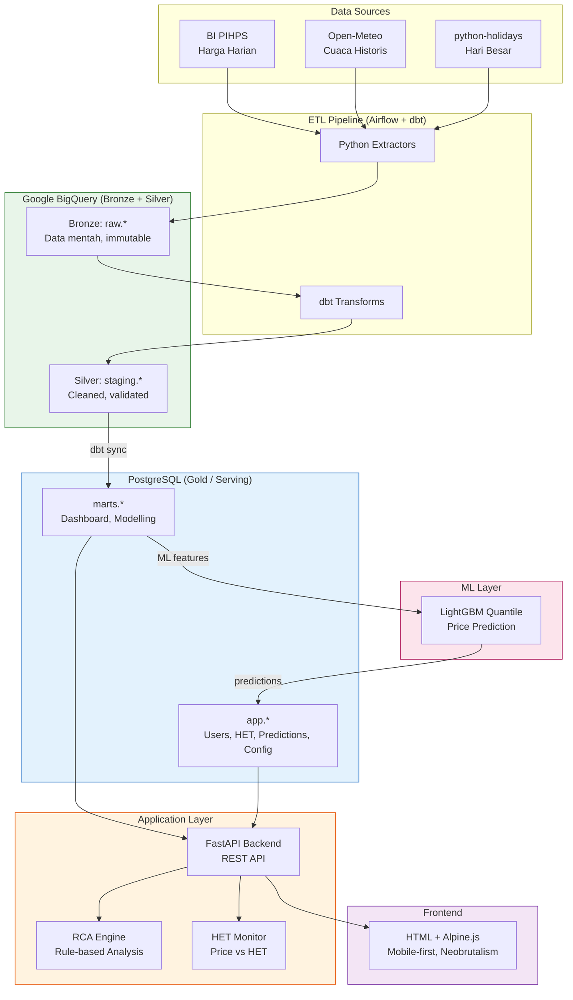

### 1.2 Request Flow

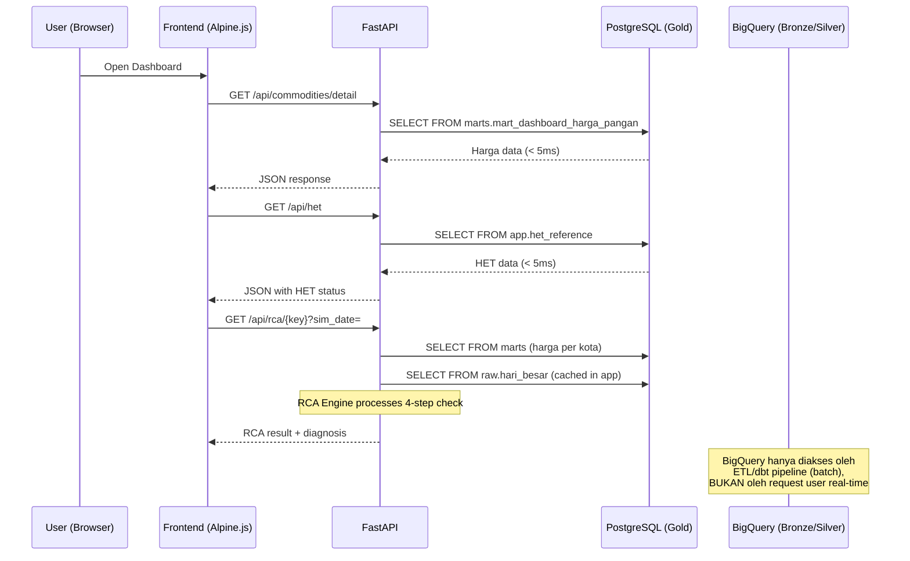

---

## 2. Component Architecture

### 2.1 Component Diagram

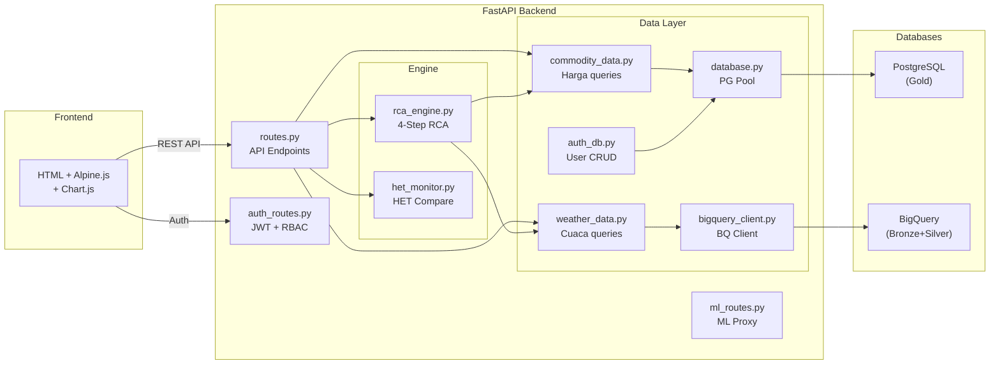

### 2.2 Component Responsibilities

| Component | File | Responsibility | Depends On |
|-----------|------|---------------|------------|
| **API Routes** | `src/api/routes.py` | HTTP endpoints untuk commodities, RCA, HET, cuaca, predictions, data quality | Engine + Data Layer |
| **Auth Routes** | `src/api/auth_routes.py` | Login, JWT, user CRUD, RBAC guards | auth_db |
| **ML Routes** | `src/api/ml_routes.py` | Proxy ke ML model serving | External ML service |
| **RCA Engine** | `src/engine/rca_engine.py` | 4-step sequential decision tree | commodity_data, weather_data |
| **HET Monitor** | `src/engine/het_monitor.py` | Compare harga vs HET → status | config/settings |
| **Commodity Data** | `src/data/commodity_data.py` | Query harga dari PostgreSQL Gold | database.py |
| **Weather Data** | `src/data/weather_data.py` | Query cuaca (BigQuery direct untuk RCA) | bigquery_client.py |
| **Auth DB** | `src/data/auth_db.py` | User CRUD, bcrypt, verify | database.py |
| **Database** | `src/data/database.py` | PostgreSQL connection pool | psycopg2 |
| **BigQuery Client** | `src/data/bigquery_client.py` | BigQuery singleton client | google-cloud-bigquery |

### 2.3 Data Layer — Query Routing

| Query Type | Database | Latency Target | Example |
|-----------|----------|----------------|---------|
| Dashboard harga, HET, predictions | PostgreSQL (Gold) | < 5ms | `SELECT FROM marts.mart_dashboard_harga_pangan` |
| User auth, CRUD | PostgreSQL (Gold) | < 5ms | `SELECT FROM app.users WHERE username = %s` |
| RCA cuaca check | BigQuery (Bronze) | < 2s | `SELECT FROM raw.cuaca_harian WHERE tanggal BETWEEN...` |
| RCA hari besar | PostgreSQL (Gold) cache | < 1ms | In-memory cache, loaded at startup |
| ETL pipeline, dbt | BigQuery | N/A (batch) | dbt transforms |

> **Catatan Performance**: Saat ini RCA cuaca masih query BigQuery langsung. Di production, cuaca data juga harus di-sync ke PostgreSQL Gold layer agar semua request user < 5ms.

---

## 3. Data Architecture — Medallion Pipeline

### 3.1 Pipeline Flow

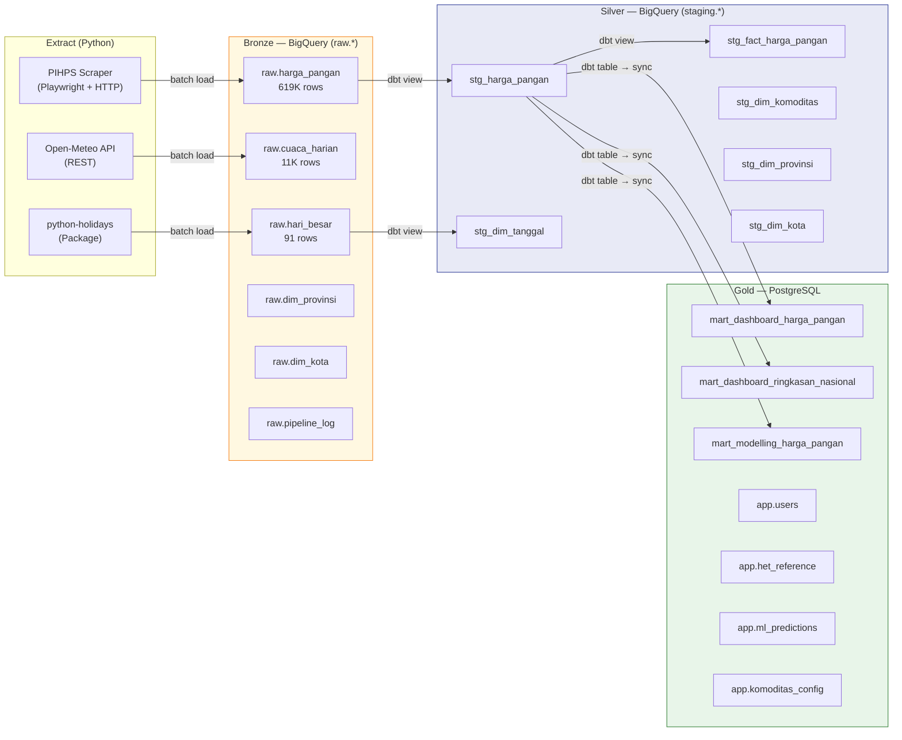

### 3.2 Data Sync: BigQuery → PostgreSQL

Gold layer data di-compute di BigQuery (via dbt) lalu di-sync ke PostgreSQL:

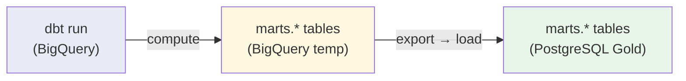

**Sync methods (opsi):**

| Method | Effort | Pros | Cons |
|--------|--------|------|------|
| Python script (`bq export → psycopg2 insert`) | Small | Simple, full control | Custom code |
| `dbt-postgres` target kedua | Medium | Native dbt, SQL-based | Perlu 2 profiles |
| BigQuery → GCS → `COPY FROM` | Medium | Efficient untuk volume besar | Extra step (GCS) |

**Recommended untuk MVP**: Python sync script — simple, run setelah dbt selesai.

### 3.3 Pipeline Schedule

| DAG | Schedule | Proses | Duration (est.) |
|-----|----------|--------|-----------------|
| `dag_data_ready_dashboard` | Daily 07:00 WIB | Extract PIHPS → Bronze → dbt → Sync Gold | ~10-15 min |
| `dag_data_ready_modelling` | Manual / Weekly | Full historical reprocess → ML features | ~30-60 min |
| `dag_sync_gold` | After dbt run | BigQuery marts → PostgreSQL Gold | ~2-5 min |

---

## 4. API Architecture

### 4.1 API Design Principles

| Principle | Implementation |
|-----------|---------------|
| RESTful | Resource-based URLs: `/api/commodities`, `/api/rca/{key}` |
| Stateless | JWT token di setiap request, no server-side session |
| Consistent | Semua response JSON, error format standar |
| Simulation-friendly | `?sim_date=YYYY-MM-DD` parameter untuk demo/historical review |
| Parameterized SQL | `%s` placeholders, no f-string interpolation |

### 4.2 API Gateway / Middleware

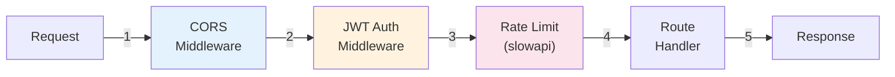

| Middleware | Status | Config |
|-----------|--------|--------|
| CORS | **[SHOULD]** belum ada | `allow_origins` explicit, bukan `"*"` |
| JWT Auth | ✅ Ada | HS256, 8 jam, `OAuth2PasswordBearer` |
| Rate Limiting | **[SHOULD]** belum ada | `slowapi`, 5/menit pada `/login` |
| Security Headers | **[SHOULD]** belum ada | CSP, X-Frame-Options, X-Content-Type-Options |

### 4.3 Response Format

**Success:**
```json
{
  "commodity_key": "cabai_merah_besar",
  "commodity_name": "Cabai Merah Besar",
  "diagnosis": "demand",
  "price_delta_pct": 5.7,
  "is_anomaly": true
}
```

**Error:**
```json
{
  "detail": "Komoditas 'xyz' tidak ditemukan"
}
```

---

## 5. Frontend Architecture

### 5.1 Technology Stack

| Component | Technology | Version | CDN |
|-----------|-----------|---------|-----|
| UI Framework | Alpine.js | 3.x | jsdelivr |
| Charting | Chart.js | 4.4.4 | jsdelivr |
| CSS | External stylesheet (Neobrutalism) | — | `frontend/css/style.css` |
| Fonts | Inter + JetBrains Mono | — | Google Fonts |
| Build | None (no build step) | — | — |

### 5.2 CSS Architecture

**Prinsip**: CSS **tidak boleh inline** di HTML. Semua styling di external file agar maintainable.

```
frontend/
├── css/
│   └── style.css           ← Semua styling di sini
├── index.html               ← <link rel="stylesheet" href="/css/style.css">
├── login.html
├── rca.html
├── prediksi.html
└── admin.html
```

| Approach | Detail |
|----------|--------|
| External CSS file | `frontend/css/style.css` — satu file untuk semua halaman |
| CSS Custom Properties | `:root { --accent: #2ECC88; }` — design tokens di satu tempat |
| Class-based styling | HTML hanya pakai `class="card"`, bukan `style="padding: 16px;"` |
| No CSS framework | Custom CSS, no Tailwind/Bootstrap — full control, smaller footprint |
| No build step | Plain CSS, no SASS/PostCSS — langsung serve |

**Alasan**: Inline style harus dicari per-element di HTML file. External CSS = satu tempat untuk semua styling, lebih mudah di-maintain dan di-review.

### 5.3 Design System

| Token | Value | Usage |
|-------|-------|-------|
| `--bg` | `#EEF7F1` | Page background |
| `--accent` | `#2ECC88` | Primary green |
| `--accent2` | `#1D7A56` | Secondary green |
| `--danger` | `#F87171` | Red alerts |
| `--warn` | `#FBBF24` | Yellow warnings |
| `--success` | `#34D399` | Green success |
| `--border` | `#1a1a1a` | Thick borders (neobrutalism) |
| `--shadow` | `4px 4px 0px #1a1a1a` | Offset shadow (neobrutalism) |
| `--radius` | `16px` | Card border radius |
| `--bw` | `2.5px` | Border width |
| `--sans` | Inter | Body text |
| `--mono` | JetBrains Mono | Monospace / code |

### 5.4 Responsive Strategy (Mobile-First)

| Breakpoint | Width | Layout | Priority |
|------------|-------|--------|----------|
| Mobile | < 768px | Single column, stacked cards | **Primary** (design first) |
| Tablet | 768-1024px | 2-column grid, expanded nav | Secondary |
| Desktop | > 1024px | 3-column grid, full sidebar | Tertiary |

### 5.5 Frontend → API Communication

```
Browser
  ├── localStorage.getItem('token') → JWT
  ├── fetch('/api/...', { headers: { Authorization: 'Bearer ' + token } })
  ├── Alpine.js x-data → reactive state
  └── Chart.js → canvas rendering
```

---

## 6. ML Architecture

### 6.1 Three-Layer ML Pipeline

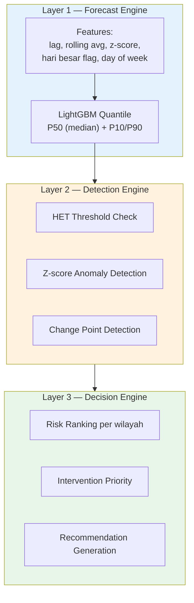

### 6.2 ML Data Contract

| Direction | Table | Schema |
|-----------|-------|--------|
| ML reads features from | `mart_modelling_harga_pangan` (PostgreSQL Gold) | tanggal, comcat_id, kota_id, harga, lag/rolling features, z_score |
| ML writes predictions to | `app.ml_predictions` (PostgreSQL Gold) | komoditas_id, kota_id, prediction_date, target_date, predicted_price, confidence_lower/upper, model_version |

### 6.3 ML Serving (Production)

| Aspect | Specification |
|--------|---------------|
| Model format | Pickle / ONNX |
| Serving | FastAPI container (port 8001) atau batch predict |
| Inference frequency | Daily (after pipeline sync) atau on-demand |
| Latency target | < 500ms per prediction request |
| Docker | Separate container dalam docker-compose |

---

## 7. Infrastructure Architecture

### 7.1 Infrastructure as Code (Terraform)

```
infra/
├── main.tf              ← GCP provider + BigQuery API enable
├── bigquery.tf           ← 3 datasets (raw, staging, marts) + 8 raw tables
├── variables.tf          ← project_id, region, bq_location
├── outputs.tf            ← Output definitions
├── terraform.tfvars      ← Actual values (gitignored)
└── terraform.tfvars.example
```

BigQuery resources provisioned:
- 3 datasets: `raw`, `staging`, `marts`
- 8 tables di `raw.*` (with partitioning + clustering)
- `deletion_protection = true` pada tabel utama

### 7.2 Docker Architecture

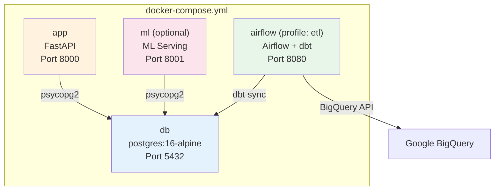

---

## 8. Deployment Architecture

### 8.1 Development & Demo (Current)

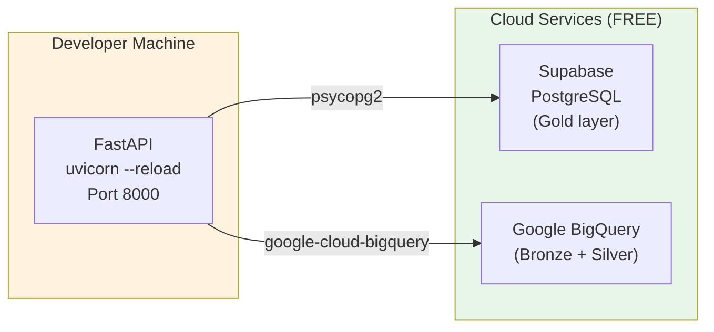

| Aspect | Detail |
|--------|--------|
| App server | Local (`uvicorn --reload`) |
| PostgreSQL | Supabase Cloud (free tier, 500MB) |
| BigQuery | GCP free tier (10GB, 1TB queries) |
| Cost | **$0** |
| Internet required | Ya (Supabase + BigQuery di cloud) |
| Setup time | < 10 menit |

### 8.2 Production (Go-Live)

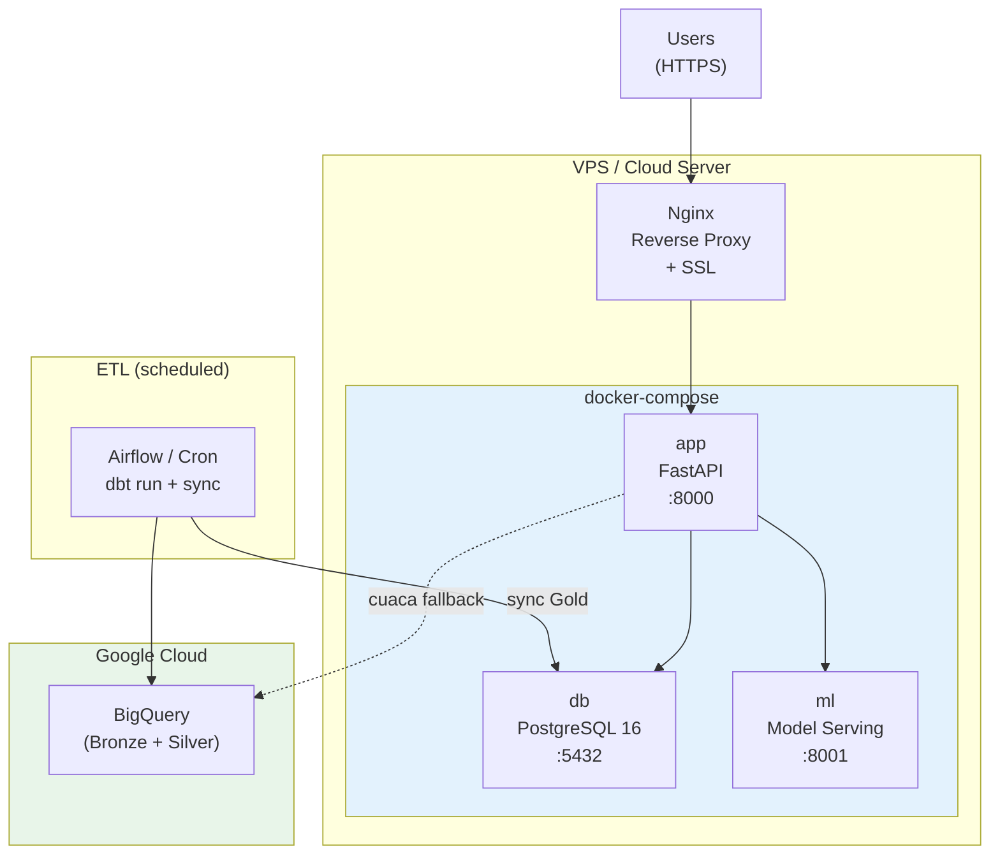

| Aspect | Detail |
|--------|--------|
| App + DB + ML | Docker Compose di 1 VPS |
| Reverse proxy | Nginx (SSL termination, static files) |
| HTTPS | Let's Encrypt (free SSL) |
| PostgreSQL | Docker `postgres:16-alpine` |
| BigQuery | GCP (hanya untuk ETL pipeline, bukan user requests) |
| ETL | Airflow atau cron job (daily) |
| Domain | Custom domain + DNS |

---

## 9. Performance Design

### 9.1 Latency Targets

| Operation | Target | Strategy |
|-----------|--------|----------|
| Dashboard page load | < 3 detik | Gold layer pre-computed di PostgreSQL |
| API response (p95) | < 200ms | PostgreSQL query < 5ms + JSON serialize |
| RCA analysis | < 2 detik | Data sudah di Gold (PostgreSQL), engine compute ~100ms |
| ML prediction read | < 100ms | Direct SELECT dari PostgreSQL |
| Login | < 500ms | bcrypt verify ~200ms + JWT sign |

### 9.2 Performance Strategies

| Strategy | Implementation | Impact |
|----------|---------------|--------|
| **Gold layer pre-compute** | dbt materialized tables di PostgreSQL | Dashboard queries < 5ms (vs BigQuery ~1-3s) |
| **Connection pooling** | `psycopg2` connection pool (5-10 connections) | Avoid connection overhead per request |
| **BigQuery partitioning** | `raw.harga_pangan` partitioned by `tanggal`, clustered by `comcat_id` | Query cost ↓90%, scan ↓ |
| **In-memory cache** | Hari besar calendar loaded at startup | Zero-latency RCA Step 1 |
| **Static frontend** | HTML + CDN JS/CSS, no build/SSR | Instant first paint |
| **Lazy loading** | Komoditas map loaded at startup, predictions on-demand | Faster initial load |

### 9.3 Database Indexing (PostgreSQL Gold)

| Table | Recommended Index | Query Pattern |
|-------|-------------------|---------------|
| `mart_dashboard_harga_pangan` | `(tanggal, comcat_id)` | Dashboard filter by date + komoditas |
| `mart_dashboard_ringkasan_nasional` | `(tanggal)` | Summary by date |
| `mart_modelling_harga_pangan` | `(comcat_id, kota_id, tanggal)` | ML feature lookup |
| `app.ml_predictions` | `(komoditas_id, target_date)` | Predictions page filter |
| `app.users` | `(username)` UNIQUE | Login lookup |
| `app.het_reference` | `(comcat_id)` | HET check per komoditas |

---

## 10. Security Architecture

### 10.1 Authentication Flow

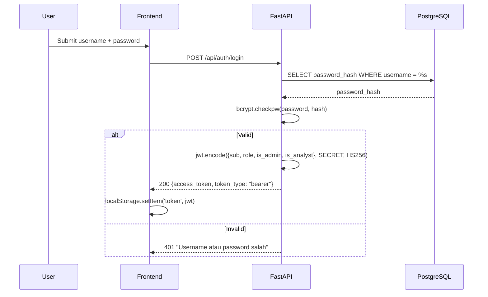

### 10.2 Security Measures

| Layer | Measure | Status |
|-------|---------|--------|
| **Transport** | HTTPS (Let's Encrypt) | 🔜 Production |
| **Auth** | JWT HS256, 8 jam expire | ✅ |
| **Password** | bcrypt hash (12 rounds) | ✅ |
| **RBAC** | Boolean flags (is_admin, is_analyst) | ✅ Frontend, **[SHOULD]** Backend |
| **SQL Injection** | Parameterized queries (`%s` placeholders) | ✅ Mostly (1 pattern to fix) |
| **CORS** | CORSMiddleware (explicit origins) | **[SHOULD]** |
| **Rate Limiting** | slowapi on /login | **[SHOULD]** |
| **Secrets** | Environment variables (.env, gitignored) | ✅ |
| **Headers** | CSP, X-Frame-Options, etc. | **[SHOULD]** |
| **JWT Secret** | ENV var, error if missing | **[SHOULD]** (currently has fallback) |

---

## 11. Cost Analysis

### 11.1 Development & Demo — $0/bulan

| Service | Tier | Limit | Current Usage | Cost |
|---------|------|-------|---------------|------|
| Supabase PostgreSQL | Free | 500 MB, 50K MAU | ~50 MB, 2 users | $0 |
| Google BigQuery Storage | Free | 10 GB | ~250 MB | $0 |
| Google BigQuery Queries | Free | 1 TB/bulan | Minimal | $0 |
| GCP Terraform | Free | N/A | IaC only | $0 |
| Open-Meteo API | Free | Unlimited (non-commercial) | ~11K rows | $0 |
| BI PIHPS | Free | Public data | ~619K rows | $0 |
| GitHub | Free | Private repo | 1 repo | $0 |
| **Total** | | | | **$0** |

### 11.2 Production (Go-Live) — Estimated

| Service | Spec | Monthly Cost | Notes |
|---------|------|-------------|-------|
| **VPS (App + DB + ML)** | 2 vCPU, 4GB RAM, 80GB SSD | $20-25 | DigitalOcean / AWS Lightsail |
| **BigQuery Storage** | ~500 MB (growing) | $0 | Within free tier |
| **BigQuery Queries** | ETL only (daily batch) | $0 | < 1 TB/bulan |
| **Domain** | `.id` atau `.com` | $1-2 | Yearly, amortized |
| **SSL** | Let's Encrypt | $0 | Free, auto-renew |
| **DNS** | Cloudflare | $0 | Free tier |
| **Monitoring** | UptimeRobot / Better Uptime | $0 | Free tier (50 monitors) |
| **Backup** | VPS snapshot (weekly) | $2-4 | 20% of VPS cost |
| **Total** | | **~$25-35/bulan** | |

### 11.3 Cost Scaling Projection

| Scale | Users | Data Volume | VPS Spec | Est. Cost |
|-------|-------|-------------|----------|-----------|
| MVP / Pilot | 5-50 | ~1 GB | 2 vCPU, 4GB | $25/bulan |
| Regional (1 provinsi) | 50-200 | ~5 GB | 4 vCPU, 8GB | $50/bulan |
| National (34 provinsi) | 200-1000 | ~50 GB | 8 vCPU, 16GB | $100-150/bulan |
| Enterprise | 1000+ | ~200 GB | Kubernetes cluster | $300-500/bulan |

> **Note**: BigQuery cost tetap rendah karena hanya dipakai untuk ETL batch (bukan user queries). Semua user traffic ke PostgreSQL.

### 11.4 Cost Optimization Strategies

| Strategy | Saving | Detail |
|----------|--------|--------|
| Gold layer di PostgreSQL | ~$50-100/bulan | Avoid BigQuery per-query cost untuk user traffic |
| BigQuery partition filter | ~90% query cost ↓ | `require_partition_filter = true` pada `raw.harga_pangan` |
| Static frontend (no CDN needed) | ~$10/bulan | HTML files served by Nginx, bukan CDN |
| Let's Encrypt SSL | ~$10/bulan | Free vs paid SSL certificate |
| Single VPS (docker-compose) | ~$50/bulan | vs 3 separate servers (App + DB + ML) |

---

## 12. Scalability Design

### 12.1 Current Bottlenecks (MVP)

| Bottleneck | Severity | Solution |
|-----------|----------|----------|
| BigQuery latency untuk user requests | High | ✅ Solved: Gold layer di PostgreSQL |
| Single FastAPI process | Low (MVP) | Gunicorn with workers di production |
| No connection pooling max | Medium | Set pool max connections |
| No caching (hari besar, komoditas map) | Medium | ✅ In-memory cache at startup |

### 12.2 Horizontal Scaling Path

```
MVP (1 VPS)                    Scale-out (multiple)
┌──────────────┐              ┌─────────────────────────┐
│ App + DB + ML│              │  Load Balancer (Nginx)  │
│ (1 server)   │    ──▶       │  ┌────┐ ┌────┐ ┌────┐  │
└──────────────┘              │  │App1│ │App2│ │App3│  │
                              │  └──┬─┘ └──┬─┘ └──┬─┘  │
                              │     └──────┼──────┘    │
                              │         ┌──┴──┐        │
                              │         │  DB  │       │
                              │         │(PG)  │       │
                              │         └─────┘        │
                              └─────────────────────────┘
```

| Scale Level | Architecture | When |
|-------------|-------------|------|
| Level 1 (MVP) | Single VPS, docker-compose | 0-50 users |
| Level 2 | Add Gunicorn workers (4-8) | 50-200 users |
| Level 3 | Separate DB server | 200-500 users |
| Level 4 | Load balancer + multiple app instances | 500+ users |
| Level 5 | Kubernetes + managed DB | 1000+ users |

### 12.3 Data Scaling

| Current | 1 Year | 3 Year |
|---------|--------|--------|
| 619K rows (harga) | ~850K rows | ~1.5M rows |
| 11K rows (cuaca) | ~15K rows | ~25K rows |
| 6 komoditas | 12-15 komoditas | 21+ komoditas |
| 4 provinsi | 10 provinsi | 34 provinsi |
| ~250 MB (BigQuery) | ~500 MB | ~2 GB |
| ~50 MB (PostgreSQL Gold) | ~200 MB | ~1 GB |

BigQuery free tier (10 GB storage) cukup untuk **3+ tahun** bahkan dengan full 34 provinsi.

---

## 13. Monitoring & Observability

> **Prinsip**: Biaya monitoring harus $0. Tidak pakai Grafana, Datadog, atau paid tools. Cukup SSH + bash scripting + logging.

### 13.1 Monitoring Strategy

| Layer | Method | Cost | Detail |
|-------|--------|------|--------|
| **Server health** | Bash script (cron) | $0 | CPU, RAM, disk, Docker containers status |
| **Application** | Python `logging` module | $0 | Request errors, latency, RCA results → log files |
| **Database** | `pg_stat_statements` | $0 | Slow queries, connection count (via SSH) |
| **Uptime** | UptimeRobot (free) | $0 | Ping endpoint setiap 5 menit, email alert |
| **Pipeline** | `raw.pipeline_log` (BigQuery) | $0 | ETL run status, records inserted, failures |

### 13.2 Bash Monitoring Script

Automated monitoring via cron, output disimpan di server atau di-push ke BigQuery:

```bash
#!/bin/bash
# scripts/monitor.sh — run via cron every 5 minutes
TIMESTAMP=$(date -u +"%Y-%m-%dT%H:%M:%SZ")
LOG_DIR=/var/log/radarpangan

# CPU & Memory
CPU=$(top -bn1 | grep "Cpu(s)" | awk '{print $2}')
MEM_TOTAL=$(free -m | awk '/Mem:/ {print $2}')
MEM_USED=$(free -m | awk '/Mem:/ {print $3}')
DISK_PCT=$(df -h / | awk 'NR==2 {print $5}' | tr -d '%')

# Docker container status
APP_STATUS=$(docker inspect --format='{{.State.Status}}' radarpangan-app 2>/dev/null || echo "not_found")
DB_STATUS=$(docker inspect --format='{{.State.Status}}' radarpangan-db 2>/dev/null || echo "not_found")

# App health check
HTTP_CODE=$(curl -s -o /dev/null -w "%{http_code}" http://localhost:8000/health 2>/dev/null || echo "000")

# Log to file
echo "${TIMESTAMP},${CPU},${MEM_USED}/${MEM_TOTAL},${DISK_PCT}%,app=${APP_STATUS},db=${DB_STATUS},http=${HTTP_CODE}" \
  >> ${LOG_DIR}/server_metrics.csv

# Alert if something is wrong
if [ "$HTTP_CODE" != "200" ] || [ "$APP_STATUS" != "running" ] || [ "$DISK_PCT" -gt 85 ]; then
  echo "[ALERT] ${TIMESTAMP} — HTTP=${HTTP_CODE} APP=${APP_STATUS} DISK=${DISK_PCT}%" \
    >> ${LOG_DIR}/alerts.log
fi
```

**Cron setup:**
```
*/5 * * * * /opt/radarpangan/scripts/monitor.sh
```

### 13.3 Log Storage

| Log Type | Storage | Retention | Format |
|----------|---------|-----------|--------|
| Server metrics (CPU, RAM, disk) | Server filesystem (`/var/log/radarpangan/`) | 30 hari (logrotate) | CSV |
| Application logs (FastAPI) | Server filesystem | 14 hari (logrotate) | JSON structured |
| Pipeline logs | BigQuery (`raw.pipeline_log`) | Indefinite | Table rows |
| Alert logs | Server filesystem | 90 hari | Plain text |

**Optional**: Push server metrics ke BigQuery via weekly batch script untuk historical analysis (karena BigQuery storage gratis).

### 13.4 Health Check Endpoint

```
GET /health → { "status": "ok", "version": "0.5.0", "db": "connected", "bq": "connected" }
```

---

## 14. Disaster Recovery

### 14.1 Backup Strategy

| Data | Method | Frequency | Retention |
|------|--------|-----------|-----------|
| PostgreSQL (Gold) | `pg_dump` → compressed file | Daily | 7 days |
| BigQuery (Bronze+Silver) | Native BQ snapshots | Weekly | 30 days |
| VPS | Provider snapshot | Weekly | 4 snapshots |
| Code | Git (GitHub private repo) | Every commit | Indefinite |
| Config | `.env` encrypted backup | On change | Version controlled |

### 14.2 Recovery Time

| Scenario | RTO (Recovery Time) | RPO (Data Loss) | Action |
|----------|---------------------|------------------|--------|
| App crash | < 5 menit | 0 | Docker restart |
| DB corruption | < 30 menit | < 24 jam | Restore from pg_dump |
| VPS failure | < 2 jam | < 24 jam | Provision new VPS + restore |
| BigQuery issue | < 1 jam | 0 | Data immutable, re-run dbt |

---

## Appendix A: Technology Decision Records

| Decision | Chosen | Alternatives Considered | Rationale |
|----------|--------|------------------------|-----------|
| Frontend framework | HTML + Alpine.js | React (proposal), Vue, Svelte | No build step, faster dev, timeline < 3 minggu |
| Data warehouse | BigQuery | Supabase PostgreSQL, DuckDB | Free 10GB + 1TB queries, auto-scale, partitioning |
| App database | PostgreSQL (Docker) | Supabase managed, SQLite | Familiar (kantor), no vendor lock-in, no limit |
| ETL orchestration | Airflow | Prefect, Dagster, Cron | Most mature, good UI, team familiar |
| SQL transforms | dbt | Python transforms, stored procedures | Modular, testable, version controlled |
| IaC | Terraform | Pulumi, CloudFormation | Multi-cloud, HCL readable, GCP support |
| ML framework | LightGBM | XGBoost, CatBoost, Prophet | Fast, quantile regression native, good accuracy |
| Auth | JWT + bcrypt | OAuth2, Supabase Auth, Firebase | Simple, self-contained, no external dependency |
| Design system | Neobrutalism | Material, Bootstrap, Tailwind | Distinctive, memorable for hackathon demo |
| CSS approach | External CSS file | Inline `<style>`, CSS modules, Tailwind | Maintainable, satu tempat untuk semua styling |

## Appendix B: Related Documents

| Document | Path | Status |
|----------|------|--------|
| PRD | `docs/prd/PRD.md` | ✅ |
| FRD | `docs/frd/FRD.md` | ✅ |
| ERD | `docs/erd/ERD.md` | ✅ |
| Wireframe | `docs/wireframe/wireframe-all-pages.html` | ✅ |
| Tech Stack | `docs/tech-stack/` | 🔜 Next |
| Testing Report | `docs/NEED_TO_FIX.md` | ✅ |
| Demo Scenarios | `docs/demo-scenarios.md` | ✅ |
